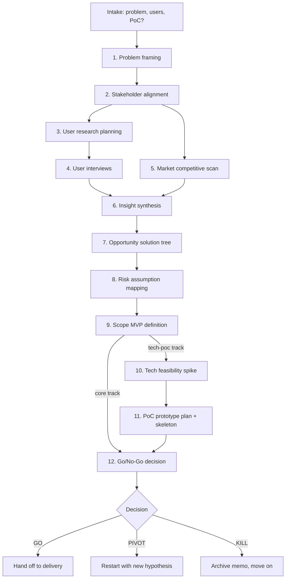

# Discovery-to-PoC flow

## Parallelism

- Phases **3** and **5** can run in parallel after phase 2.
- Phase **6** needs both 4 and 5 complete.
- Phases 10–11 are skippable via the `--core` track.

## Gating severity

- **Hard gates** (require user confirmation): end of phases 3, 4, 9, 11.
- **Soft gates** (auto-proceed with summary): 1, 2, 5, 6, 7, 8, 10, 12.
